# Waha Admin

Browser-based admin dashboard for the [Waha](../waha) kiosk platform. Built with Flutter Web, it manages the full lifecycle of a multi-store self-service kiosk network — from catalog and pricing to marketing content, reporting, and Odoo ERP integration.

---

## Screenshots

### Dashboard
Real-time KPIs (revenue, orders), sparkline trend cards, overview stats per kiosk, and rolling revenue charts.

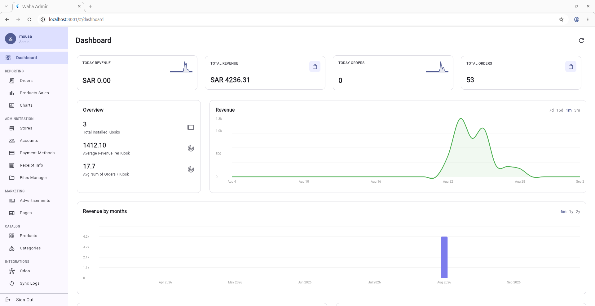
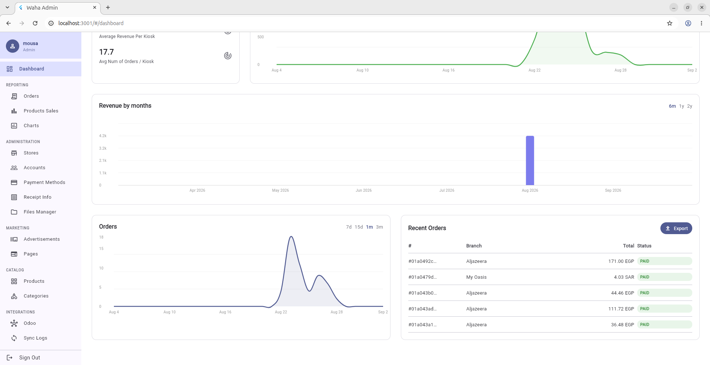

### Orders
Paginated order table with filters for branch, kiosk, status, payment type, sync state, and date range. One-click CSV and PDF export.

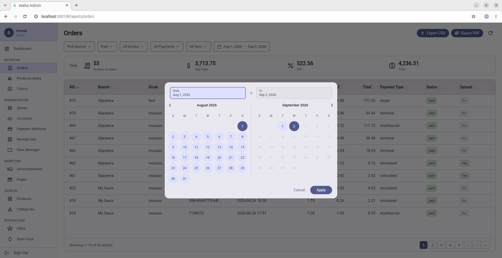
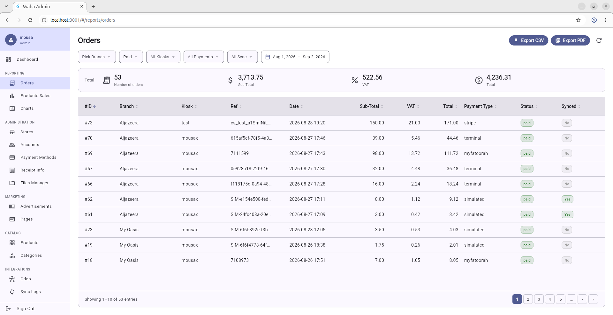

### Products
Grid view of the product catalog with category/status/store filters and full-text search. Create and edit products with bilingual names (Arabic + English), pricing, images, and category assignment.

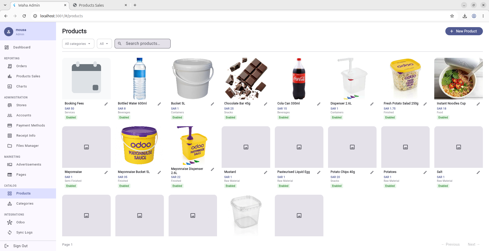

### Categories
Bilingual category management (Arabic / English) with optional category images.

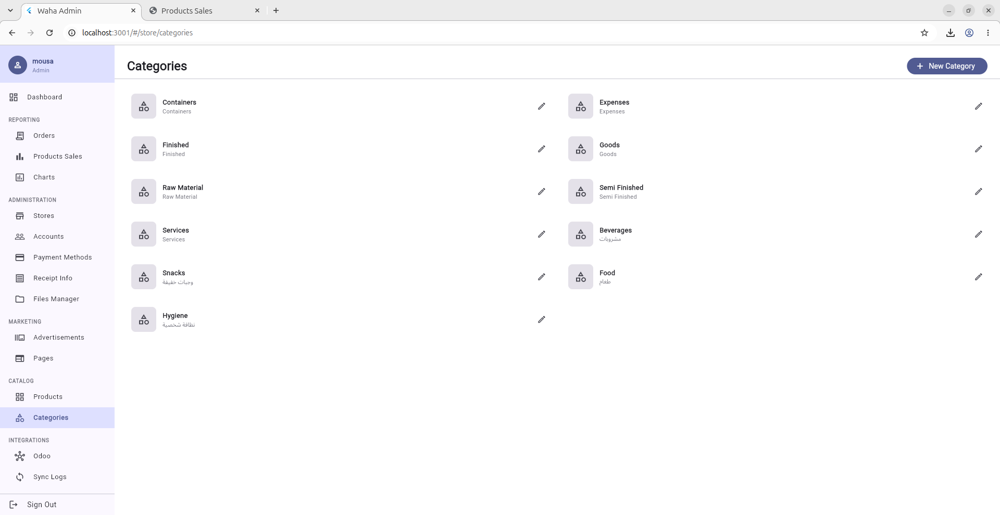

### Products Sales Report
Per-product sales summary with sortable columns.

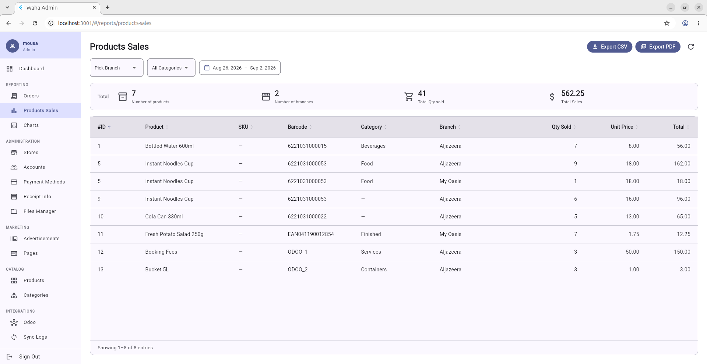

### Charts
Configurable reporting canvas: Hourly, Daily, Monthly, and Performance groups. Each group has an independent date range, chart type (Line / Bar / Pie), column count (1–3), and height multiplier (×1 / ×1.5 / ×2). Charts are generated on demand and can be opened fullscreen.

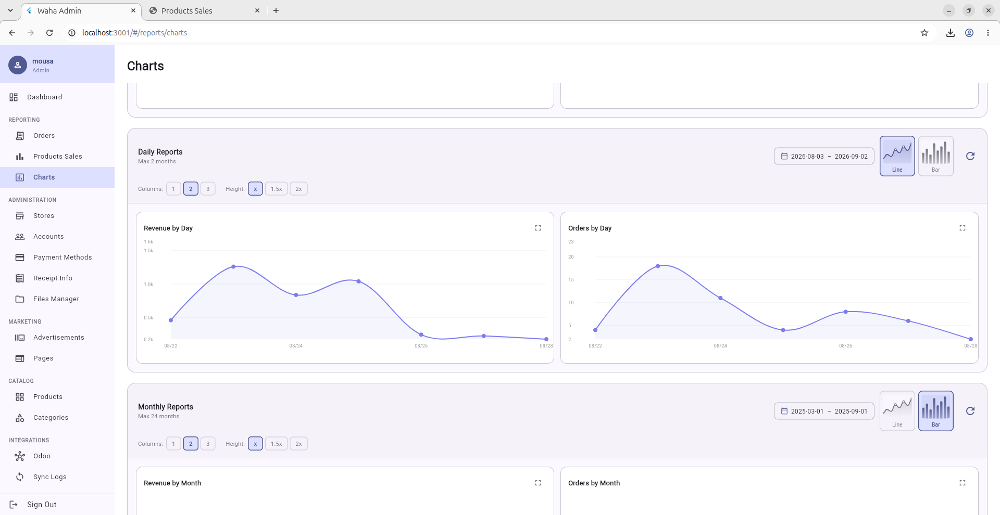
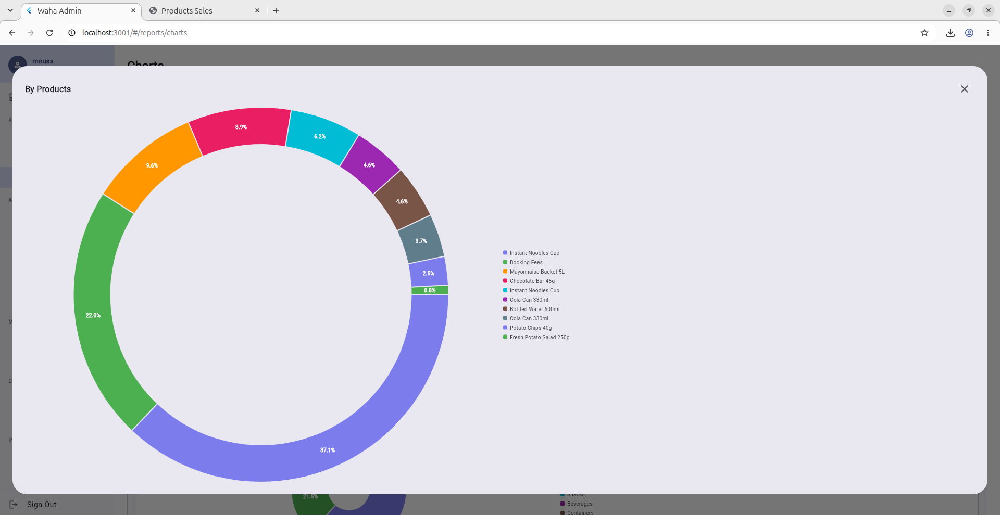
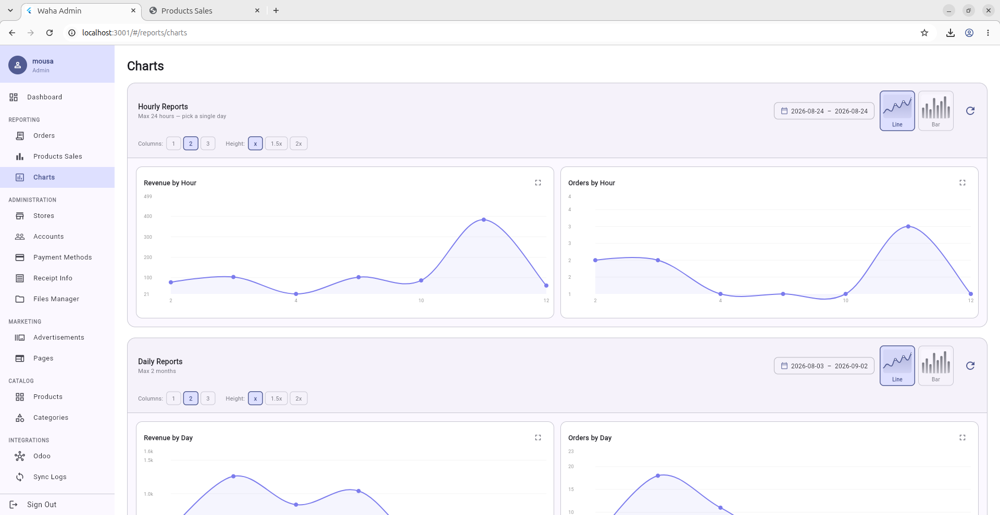

### Advertisements (Kiosk Slideshow)
Manage kiosk slideshow images as big square cards in a drag-to-reorder grid. Preview opens the generated `KIOSK_LANDING.html` in a 450 × 800 kiosk-sized window. Images can be added from the device camera, gallery, or the built-in Files Manager.

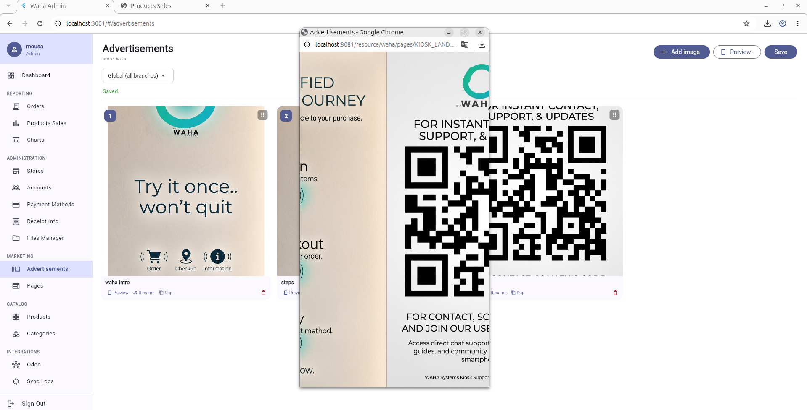

### Odoo Integration
Connect to an Odoo instance and pull categories and products incrementally. Push orders from the queue individually or in bulk. Connection status shown live.

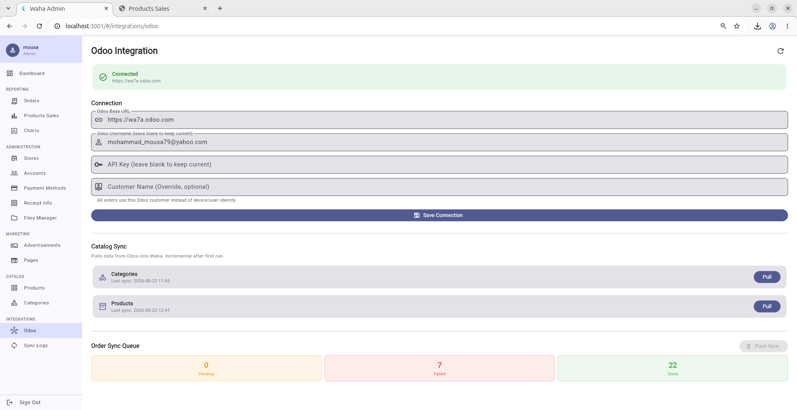
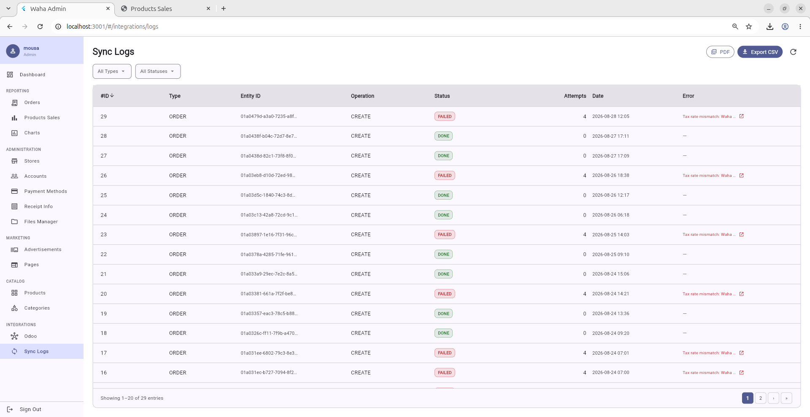

---

## Features

**Reporting**
- Live dashboard: today's revenue/orders, totals, per-kiosk averages, sparklines, rolling revenue and monthly bar charts
- Orders table: multi-filter (branch, kiosk, status, payment, sync, date range), pagination, CSV + PDF export
- Products sales: per-product revenue breakdown, sortable columns
- Charts: on-demand generation per report group, multiple chart types, configurable layout, fullscreen popup

**Catalog**
- Products: create / edit with bilingual names, pricing, category, images (camera / gallery / files manager)
- Categories: bilingual name + image

**Administration**
- Stores: multi-store hierarchy — create branches under the parent store
- Accounts: user and role management
- Payment Methods: Stripe, MyFatoorah, terminal
- Receipt Info: customize receipt header and footer
- Files Manager: resource explorer scoped to the global store

**Marketing**
- Advertisements: drag-to-reorder kiosk slideshow, rename via dialog, per-card preview, kiosk-size HTML preview
- Pages: HTML landing page editor for kiosk screens, in-app kiosk preview

**Integrations**
- Odoo: incremental catalog pull (categories + products), order sync queue with push
- Sync Logs: full integration activity trail

---

## Tech stack

| Layer | Technology |
|---|---|
| UI | Flutter Web (Dart 3) |
| State | Provider |
| HTTP | `package:http` |
| Charts | `fl_chart` |
| Backend | Spring Boot — see [`../waha`](../waha) |

---

## Running locally

**Prerequisites**
- Flutter SDK ≥ 3.44 (`flutter --version`)
- Chrome
- Waha backend running on port **8081** — see [`../waha/README.md`](../waha/README.md)

**Start the dev server**

```bash
flutter pub get
flutter run -d chrome --web-port=3001
```

The app opens at `http://localhost:3001`. Hot reload is active — changes to Dart files apply instantly.

**Custom backend URL**

```bash
flutter run -d chrome --web-port=3001 \
  --dart-define=API_BASE_URL=https://your-backend.example.com
```

**Production build**

```bash
flutter build web --dart-define=API_BASE_URL=https://your-backend.example.com
# Output: build/web/
```

---

## Project structure

```
lib/
  config/          # AppConfig (API base URL via --dart-define)
  models/          # Data classes (Store, Product, Order, …)
  router/          # Route constants and MaterialApp routing
  screens/         # One file per screen
  services/        # ApiClient — all HTTP calls
  state/           # AuthState (Provider)
  widgets/         # Shared widgets (AdminSidebar, ProductImage, …)
web/               # index.html and Flutter web bootstrap
docs/
  screenshots/     # UI screenshots used in this README
```
